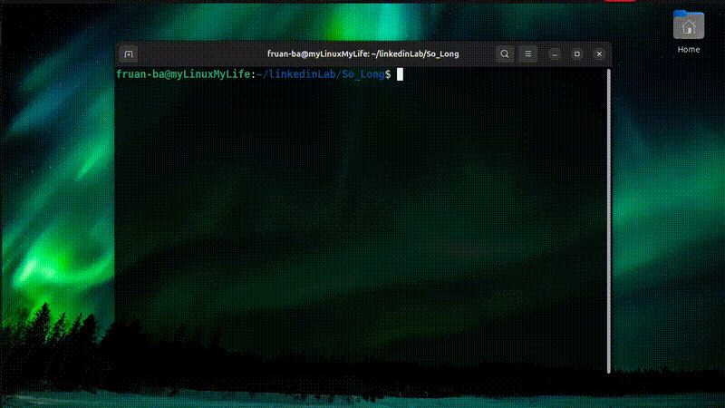
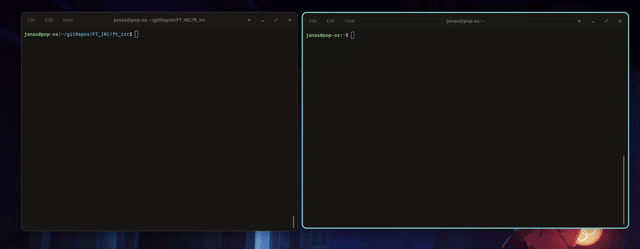

  

<h1 align="center">Hey there! I'm Fernando Ruan 👋</h1>

<h3 align="center">
  Software Engineer • Systems Programming • Interdisciplinary Learner • Curiosity-Driven Builder
</h3>

  

     Badge designed by <a href="https://github.com/lrcouto">lrcouto</a>
  

  <strong>🟢 OPEN TO WORK =D 🟢</strong>

  <a href="#about-me">About Me</a> •
  <a href="#intellectual-interests">Intellectual Interests</a> •
  <a href="#common-core-projects">42 Common Core Projects</a> •
  <a href="#specialization-42-projects">42 Specialization Projects</a> •
  <a href="#projects-visualization">42 Projects Visualization</a> •
  <a href="#competitive-programming">Competitive Programming</a> •
  <a href="#my-testers">My Testers</a> •
  <a href="#main-interests">Main Interests</a> •
  <a href="#technologies">Technologies Zone</a> •
  <a href="#soft-skills">Soft Skills</a> •
  <a href="#spoken-languages">Spoke Languages</a> •
  <a href="#github-stats">GitHub Stats</a> •
  <a href="#connect-with-me">Connect with me</a>

<h3 id="about-me">👨‍💻 &nbsp;About Me</h3>

- 🇧🇷 &nbsp; Brazilian software engineer graduated from **École 42**.
- 🛡️ &nbsp; Focused on **cybersecurity** as my main area of growth and specialization.
- 🖥️ &nbsp; Interested in **systems programming, Linux, Docker, microservices and secure infrastructure**.
- 🌍 &nbsp; Student at <a href="https://m60.com.br/">M60</a>, pursuing international standards, collaboration and continuous improvement.
- 🏋️ &nbsp; Sports enthusiast, especially **CrossFit**.
- 🚀 &nbsp; Always looking to solve real problems, strengthen my skills and build impactful projects.

<h3 id="intellectual-interests">🌌 &nbsp;Intellectual Interests</h3>

- 🏛️ &nbsp; Interested in classical traditions of thought, especially the **Trivium and Quadrivium**.
- 🇬🇷 &nbsp; Curious about **classical languages**, knowledge systems and the intellectual legacy of ancient civilizations.
- 🧩 &nbsp; Drawn to topics such as **consciousness, symbolic structures, perception and human cognition**.
- 📖 &nbsp; Interested in **memory systems, mental models, structured learning and interdisciplinary study**.
- 🌏 &nbsp; Open to global perspectives, cultural exchange and lifelong learning.
  
---

<h3 id="common-core-projects">🎮 &nbsp;42 Projects (Common Core)</h3>

<table align="center">
  <tr>
    <td></td>
    <td></td>
    <td></td>
    <td></td>
  </tr>
  <tr>
    <td></td>
    <td></td>
    <td></td>
    <td></td>
  </tr>
  <tr>
    <td></td>
    <td></td>
    <td></td>
    <td></td>
  </tr>
  <tr>
    <td></td>
    <td></td>
    <td></td>
    <td></td>
  </tr>
</table>

     Badges designed by <a href="https://github.com/lrcouto">lrcouto</a>
  

  <h3 id="specialization-42-projects" align="center">👨‍💻 &nbsp;42 Specialization Projects</h3>

  Coming soon, there will be a table here with badges of projects developed during the 42 specialization, such as Matcha, where I will build my own Tinder; Cloud, where I will gain experience with cloud platforms; Camagru, my own Instagram; and applications similar to Spotify, Hangouts and others. =D

<h3 id="projects-visualization" align="center">🎮 &nbsp;42 Projects Visualization (Common Core)</h3>

<table align="center">
   <tr>
    <td align="center">
      
      
       
      <b>So_long</b>
    </td>
  </tr>
  <tr>
    <td align="center">
      

      
     

    </td>
  </tr>
  <tr>
    <td align="center">
      🎥 Demo GIF by <a href="https://github.com/fernandoruanb">fruan-ba, yes it's me =D</a> 
    </td>
  </tr>
</table>
<table align="center">
  <tr>
    <td align="center">
      
      
       
      <b>Minishell</b>
    </td>
  </tr>
  <tr>
    <td align="center">
      

      
      

    </td>
  </tr>
  <tr>
    <td align="center">
      🎥 Demo GIF by <a href="https://github.com/oJonasRtz">oJonasRtz</a> 
      Member of our team — this demo represents a project developed collaboratively by us.
    </td>
  </tr>
</table>

 

<table align="center">
  <tr>
    <td align="center">
      
      
       
      <b>Cub3D</b>
    </td>
  </tr>
  <tr>
    <td align="center">
      

      
     

    </td>
  </tr>
  <tr>
    <td align="center">
      🎥 Demo GIF by <a href="https://github.com/oJonasRtz">oJonasRtz</a> 
      Member of our team — this demo represents a project developed collaboratively by us.
    </td>
  </tr>
</table>

 

<table align="center">
  <tr>
    <td align="center">
      
      
       
      <b>ft_irc</b>
    </td>
  </tr>
  <tr>
    <td align="center">
      

      
      

    </td>
  </tr>
  <tr>
    <td align="center">
      🎥 Demo GIF by <a href="https://github.com/oJonasRtz">oJonasRtz</a> 
      Project developed collaboratively with <a href="https://github.com/oJonasRtz">oJonasRtz</a> and <a href="https://github.com/afsser">afsser</a>.
    </td>
  </tr>
<table align="center">
  <tr>
    <td align="center">
      
      
       
      <b>ft_transcendence</b>
    </td>
  </tr>
  <tr>
    <td align="center">
      

      
    

    </td>
  </tr>
  <tr>
    <td align="center">
      🎥 Demo GIF by <a href="https://github.com/oJonasRtz">oJonasRtz</a> 
      Project developed collaboratively with <a href="https://github.com/oJonasRtz">oJonasRtz</a>, <a href="https://github.com/afsser">afsser</a>, <a href="https://github.com/jos-felipe">jos-felipe</a>, and <a href="https://github.com/SeijiUeno">SeijiUeno</a>.
    </td>
  </tr>
</table>

<h3 id="competitive-programming" align="center">🎮 &nbsp; Competitive Programming Zone, Learn how to learn and Theory Study Based on <a href="https://cppinstitute.org">C++ Institute</a>
 </h3>
<table align="center">
  <tr>
    <td><a href="https://github.com/fernandoruanb/competitive_programming"></td>
      <td><a href="https://github.com/fernandoruanb/competitive_programming"></td>
        <td><a href="https://github.com/fernandoruanb/competitive_programming"></td>
  </tr>
</table>

<h3 id="my-testers" align="center">👨‍💻 &nbsp;My Testers</h3>

  Soon, I will add my testers here, as I believe that building testers is an excellent way to develop an error-detection mindset, as well as to strengthen problem-solving across various scenarios by automating discoveries and anticipating errors before they occur.

<h3 id="extracurricular-projects" align="center">🧩 &nbsp; Extracurricular Projects</h3>

  Here I will showcase large individual software projects focused on solving real problems through complete graphical applications built with C++, Qt, and SQL.

<table align="center">
  <tr>
    <th>Image</th>
    <th>Project</th>
    <th>Progress</th>
    <th>Description</th>
    <th>Stack</th>
    <th>Type</th>
  </tr>

  <tr>
    <td align="center">
      
    </td>
    <td align="center">
      <a href="https://github.com/fernandoruanb/Discovery-Portal">
        <strong>Discovery Portal</strong>
      </a>
    </td>
    <td align="center">Planned</td>
    <td>
      A complete university library management system with a graphical interface, designed to manage books, users, shelfs, articles, courses, lessons, loans, searches and administrative workflows.
    </td>
    <td align="center">
      C++ 
      C#/Blazor 
      PostgreSQL/SQL
    </td>
    <td align="center">
      Individual Project
    </td>
  </tr>

  <tr>
    <td align="center">
      
    </td>
    <td align="center">
      <a href="https://github.com/fernandoruanb/Mysteryborne">
        <strong>Mysteryborne</strong>
      </a>
    </td>
    <td align="center">Planned</td>
    <td>
      A 2D game inspired by mystery, chaos, magic, initiation, occult symbolism, and hidden knowledge, focused on atmosphere, exploration, and narrative progression.
    </td>
    <td align="center">
      C++ 
      C#/Blazor 
      PostgreSQL/SQL
    </td>
    <td align="center">
      Individual Project
    </td>
  </tr>

  <tr>
    <td align="center">
      
    </td>
    <td align="center">
      <a href="https://github.com/fernandoruanb/miniERP">
        <strong>miniERP</strong>
      </a>
    </td>
    <td align="center">Planned</td>
    <td>
      A business ERP system designed to support inventory management, financial control, sales operations, customer records, reports, and administrative workflows.
    </td>
    <td align="center">
      C# 
      Blazor 
      PostgreSQL/SQL
    </td>
    <td align="center">
      Team Project
    </td>
  </tr>
</table>

<h2 id="main-interests" align="center">🧠 My Main Interests</h2>

<table align="center">
  <tr>
    <td></td>
    <td></td>
    <td></td>
  </tr>
  <tr>
    <td></td>
    <td></td>
    <td></td>
    
  </tr>
  <tr>
     <td></td>
<td></td>
<td></td>
  </tr>
</table>

<h2 id="technologies" align="center">⚙️ Technologies</h2>

<table align="center">
  <tr>
    <td></td>
    <td></td>
    <td></td>
    <td></td>
    <td></td>
  </tr>
  <tr>
    <td></td>
    <td></td>
    <td></td>
    <td></td>
    <td></td>
  </tr>
  <tr>
    <td></td>
    <td></td>
    <td></td>
    <td></td>
    <td></td>
  </tr>
  <tr>
    <td></td>
    <td></td>
    <td></td>
    <td></td>
    <td></td>
  </tr>
</table>

<h3 id="soft-skills">🤝 &nbsp;Soft Skills</h3>

- 📚 &nbsp; Strong **learning mindset** and openness to continuous improvement.
- 🤝 &nbsp; Comfortable with **teamwork, collaboration, and knowledge sharing**.
- 🧭 &nbsp; Interested in understanding **how systems and companies work in practice**.
- 🔍 &nbsp; Motivated to identify inefficiencies and propose practical solutions.
- 🌐 &nbsp; Open to **international environments, business travel, and global collaboration**.

---

<h3 id="spoken-languages">🌍 &nbsp;Spoke Languages</h3>

- **Brazilian Portuguese** — Native
- **English** — Conversational and continuously improving

---

<h3 id="github-stats">📈 &nbsp;GitHub Stats</h3>

 
 
 
  

 

---

<h3 id="connect-with-me">🌐 &nbsp;Connect with Me</h3>

  
  
  
  

